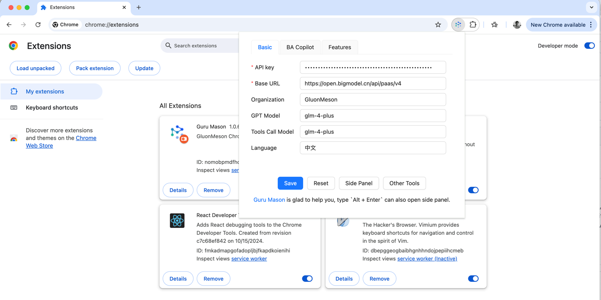
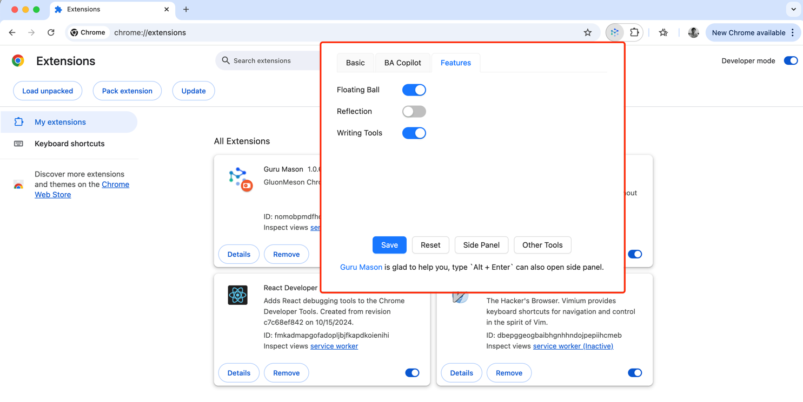
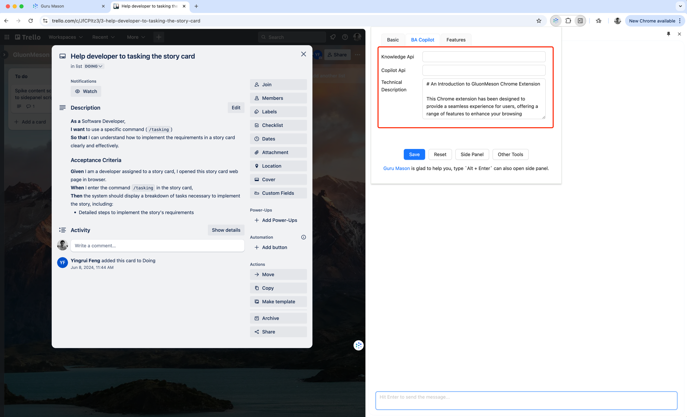
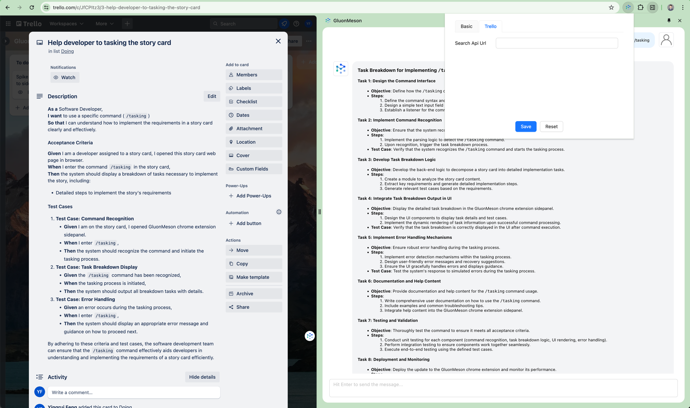
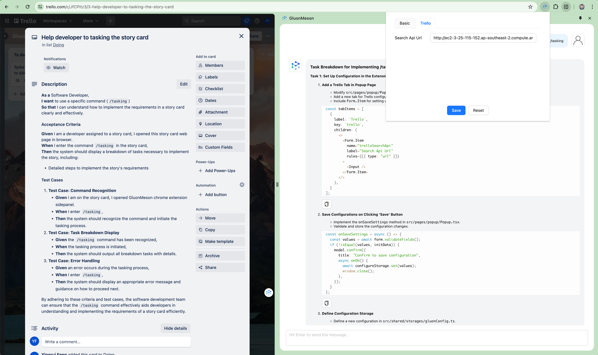

# Set up Configurations
The gru.ai can be configured with [OpenAI](https://platform.openai.com/docs/overview), [Zhipu.AI](https://open.bigmodel.cn/dev/api), [Baichuan](https://www.baichuan-ai.com/home) or Ollama. This document will guide you on how to set up configurations in the extension popup page.

## Basic Configurations
As shown in the image below, you can set up the following configurations in the extension popup page:

Above image shows the example configurations with Zhipu.AI:
* **API Key**: The API Key is from Zhipu.AI
* **Base URL**: Base url is Zhipu.AI, please check [docs](https://open.bigmodel.cn/dev/api#glm-4) to get Request URL, and notice that the base url needs to remove the `/chat/completions` at the end. Because the sdk will add it automatically.
* **Organization**: Optional configuration in OpenAI client. For Zhipu.AI, this configuration is useless. In some Enterprise GenAI Platform, this configuration could be useful for identifying the teams or use cases.
* **GPT Model**: For Zhipu.AI, you could choose glm-4 or glm-3-turbo
* **Tools Call Model**: For Zhipu.AI, you could choose glm-4 or glm-3-turbo. This configuration is optional, if it's empty, will not use tools call to recognize user intents.
* **Language**: The language you want to use, default is English.

## Feature Toggles
You can also switch features on like below:
* **Floating Ball**: If it's true, then there will be a floating ball to trigger the extension popup window.
* **Reflection**: If it's true, then the agent would reflect the given answer, and think what he can do more.
* **Writing Tools**: If it's true, then there will be writing app showing in options page.

These are parameters and supported LLM providers that you need to set up in the extension popup page.

| Configuration   | OpenAI                    | Zhipu.AI                             | Baichuan                        | Ollama                                                   |
|-----------------|---------------------------|--------------------------------------|---------------------------------|----------------------------------------------------------|
| API Key         | Provide key by yourself   | Provide key by yourself              | Provide key by yourself         | Create your own key in your environment                  |
| Base URL        | https://api.openai.com/v1 | https://open.bigmodel.cn/api/paas/v4 | https://api.baichuan-ai.com/v1  | on-premise deploy environment                            |
| Organization    | Optional                  | Not used                             | Not used                        | Used for auditing                                        |
| GPT Model       | gpt-3.5-turbo             | glm-4-plus or glm-3-turbo            | Baichuan4, Baichuan3-Turbo-128k | most cloud services & local deployed open sourced models |
| Tools Call Model| gpt-4-turbo               | glm-4-plus                           | Baichuan4, Baichuan3-Turbo-128k | depends on supported models                              |

## Other Configurations Tabs

### BA Copilot for Trello
If you need to add more configurations, you can add a new tab popup window. For example, there is a Trello tab in the popup page.

You can configure the following parameters:
* **Knowledge Api**: The API URL to search project documents.
* **Copilot Api**: The URL to specify the BackendCopilot which created by other tools.
* **Technical Description**: The technical description of current project, this is useful for GPT to understand what are you working on.

#### Usecase 
When developer try to break down the story in the trello card, they can use the extension to generate the tasking result.

#### Problem
The LLM models don't know the details of your project, so the generated tasking result may not be useful.

#### Solution
If you can provide an API to get some tasking examples of the project, then the generate tasking result will be more useful.

#### External Knowledge
You can find out all the tasking examples are in the `docs/tasking` folder. if you can import them to Backend knowledge base, and create a semantic search api. 

Then you need let Agent know this search api url, and then use this API to get the tasking examples.

*If there is no tasking example, then the generate tasking result will be less useful.*

*If there are tasking examples, then the generate tasking result will be very useful.*

Above pictures are the older version of the extension, so the configuration is still called `Search Api Url`.

You can check the [How to add new agent and command](../tasking/how_to_add_new_agent_and_command.md) to see how useful are the tasking results for the software engineer.